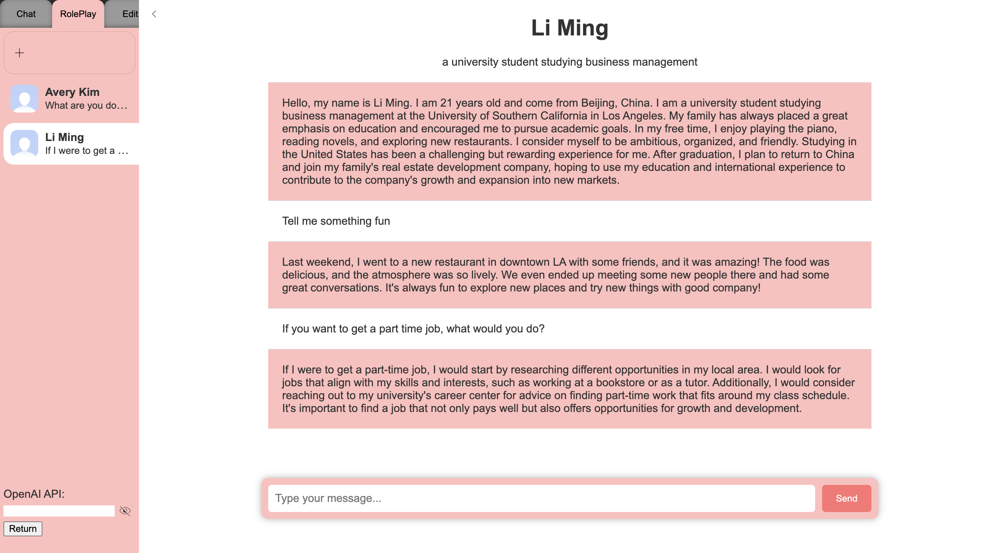
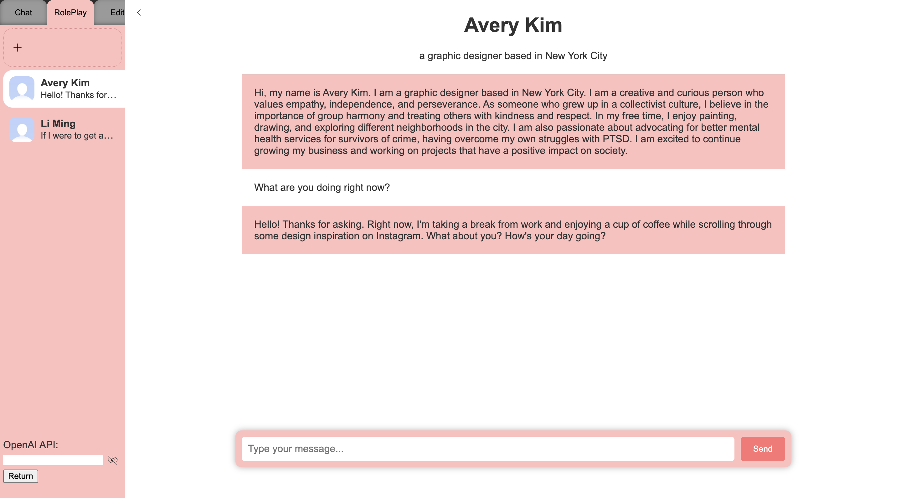

# Chatbot RPG using OpenAI's gpt models

[中文](https://lilycyf.github.io/chatgpt-rpg/README-ch.md) | English

The objective of this project is to utilize OpenAI's API to create a chatbot that possesses unique characteristics and integrate it into an RPG game.

Currently, the project features two built characters, Li Ming and Avery Kim, whom you can interact with under the roleplay section of the demo. To participate, make sure to obtain your own OpenAI KPI and input it in the provided field at the bottom left. It's essential to note that the demo is a silent website without a backend, so your OpenAI API won't be transmitted to anyone. In addition to the two characters, you can also communicate with the basic chatgpt via the chat section.

Note: You can sign up for an API key from OpenAI. Generate an API key for OpenAI's service by following the instructions on the [OpenAI website](https://platform.openai.com/account/api-keys) for free.

🔗 [demo](https://lilycyf.github.io/chatgpt-rpg/chatchatchat/demo.html)

## Screenshots

## Getting Started

1. Clone this repository to your local machine.
2. (optional) Create a virtual environment:
   1. Run the command `python3 -m venv venv` to create a new virtual environment named "venv".
   2. Activate the virtual environment by running the command `source venv/bin/activate`. On Windows, use `.\venv\Scripts\activate` instead.
3. Install the required packages listed in the `requirements.txt` file using `pip install -r requirements.txt` in your terminal.
4. Make a copy of  `config.py` under the `chatbot` folder with name `mine_config.py`.
5. Generate your own secret key in Django by running the command `python manage.py generate_secret_key` in your terminal. Replace the `SECRET_KEY` in `mine_config.py` under the `chatbot` folder with the key that you generated.
6. Sign up for an API key from OpenAI. Generate an API key for OpenAI's service by following the instructions on the [OpenAI website](https://platform.openai.com/account/api-keys) and replace the `OPENAI_API_KEY` in `mine_config.py` under the `chatbot` folder with your own key.

## Running the Chatbot

Note: If you set up a virtual environment in step 2 you will need to activate it before running any commands related to the project. To activate the virtual environment, run `source env/bin/activate`. To deactivate it, simply run the `deactivate` command.

Before start the server, navigate to the root folder of the project in your terminal and run the command `python manage.py migrate` to apply the database migrations.

To run the chatbot, run the command `python manage.py runserver`. Then open your web browser and go to `http://localhost:8000` to access the chatbot application.

## Conclusion

This project provides an example of how to build a chatbot application using OpenAI's gpt-3.5-turbo. Feel free to modify the code to suit your needs, and don't forget to create your own secret key and API key when running the application.

## License

This project is released under the [MIT License](./LICENSE).
