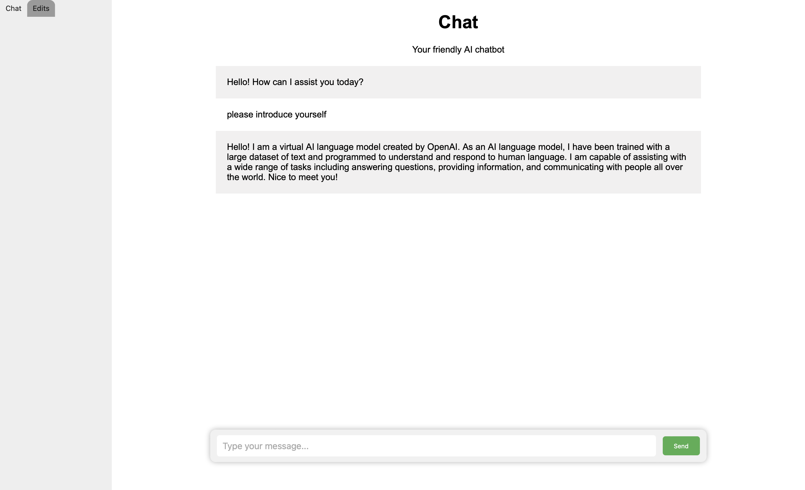
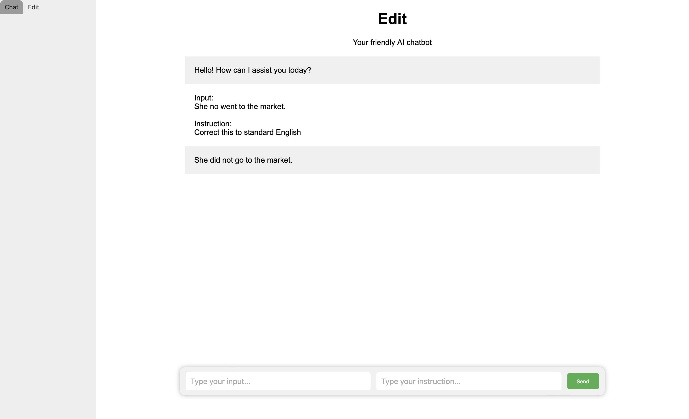

# Chatbot using OpenAI's gpt-3.5-turboGPT

This project is a chatbot application that uses OpenAI's gpt-3.5-turboGPT to generate responses to user input.

该项目是一个聊天机器人应用程序，它使用OpenAI的gpt-3.5-turboGPT来生成对用户输入的响应。

## Getting Started

1. Clone this repository to your local machine.
2. (optional) Create a virtual environment:
   1. Run the command `python3 -m venv venv` to create a new virtual environment named "venv".
   2. Activate the virtual environment by running the command `source venv/bin/activate`. On Windows, use `.\venv\Scripts\activate` instead.
3. Install the required packages listed in the `requirements.txt` file using `pip install -r requirements.txt` in your terminal.
4. Make a copy of  `config.py` under the `chatbot` folder with name `mine_config.py`.
5. Generate your own secret key in Django by running the command `python manage.py generate_secret_key` in your terminal. Replace the `SECRET_KEY` in `mine_config.py` under the `chatbot` folder with the key that you generated.
6. Sign up for an API key from OpenAI. Generate an API key for OpenAI's service by following the instructions on the [OpenAI website](https://platform.openai.com/account/api-keys) and replace the `OPENAI_API_KEY` in `mine_config.py` under the `chatbot` folder with your own key.

.

1. 将此存储库克隆到本地计算机。
3. （可选）创建虚拟环境：
   1. 运行命令 `python3 -m venv venv`以创建名为 "venv" 的新虚拟环境。
   2. 激活虚拟环境，请在终端中运行命令 `source venv/bin/activate`。在 Windows 上，请使用 `.\venv\Scripts\activate`。
4. 在终端中使用 `pip install -r requirements.txt` 命令安装 `requirements.txt` 文件中列出的必需包。
5. 复制 `chatbot` 文件夹下的 `config.py` 文件并将其重命名为 `mine_config.py`。
6. 在终端中运行命令 `python manage.py generate_secret_key` 以在 Django 中生成自己的密钥。然后将 `chatbot` 文件夹下 `mine_config.py` 文件中的 `SECRET_KEY` 替换为您生成的密钥。
7. 在 OpenAI 上注册 API 密钥。请按照 [OpenAI 网站](https://platform.openai.com/account/api-keys) 上的说明生成 OpenAI 服务的 API 密钥，然后将 `chatbot` 文件夹下的 `mine_config.py` 文件中的 `OPENAI_API_KEY` 替换为您自己的密钥。

## Running the Chatbot

Note: If you set up a virtual environment in step 2 you will need to activate it before running any commands related to the project. To activate the virtual environment, run `source env/bin/activate`. To deactivate it, simply run the `deactivate` command.

Before start the server, navigate to the root folder of the project in your terminal and run the command `python manage.py migrate` to apply the database migrations.

To run the chatbot, run the command `python manage.py runserver`. Then open your web browser and go to `http://localhost:8000` to access the chatbot application.

.

注意：如果在步骤2中设置了虚拟环境，则在运行与该项目相关的任何命令之前，您需要激活它。要激活虚拟环境，请运行 `source env/bin/activate`。要停用它，只需运行 `deactivate`命令。

在开始服务器之前，请在终端中导航到项目的根文件夹，并运行命令 `python manage.py migrate`以应用数据库迁移。

要运行聊天机器人，请运行命令 `python manage.py runserver`。然后打开您的Web浏览器，转到 `http://localhost:8000`以访问聊天机器人应用程序。

## Conclusion

This project provides an example of how to build a chatbot application using OpenAI's gpt-3.5-turbo. Feel free to modify the code to suit your needs, and don't forget to create your own secret key and API key when running the application.

.

该项目提供了如何使用OpenAI的gpt-3.5-turbo构建聊天机器人应用程序的示例。随意修改代码以满足您的需求，并在运行应用程序时不要忘记创建自己的秘密密钥和API密钥。
