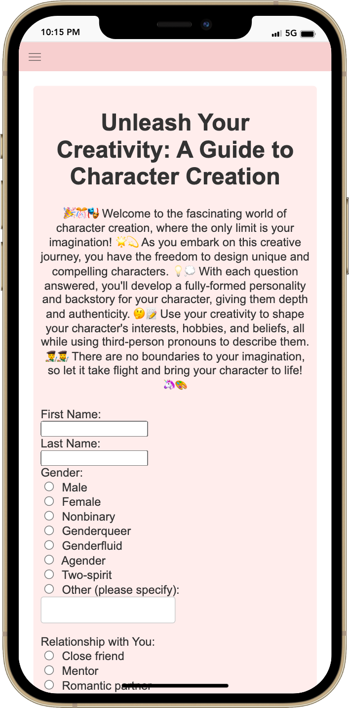
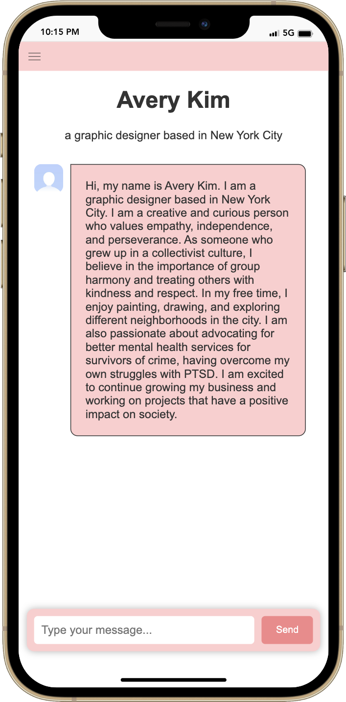
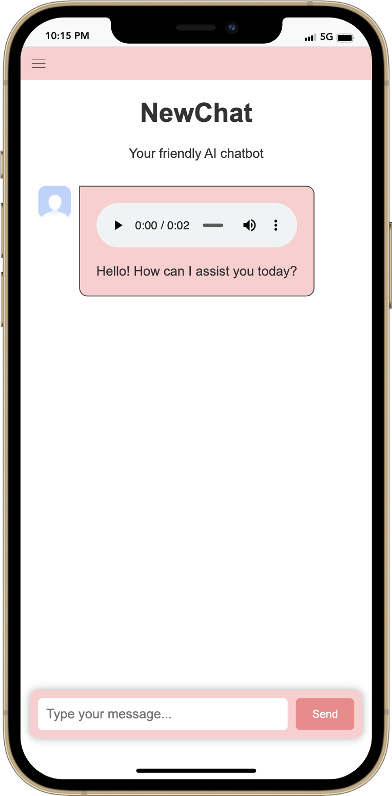
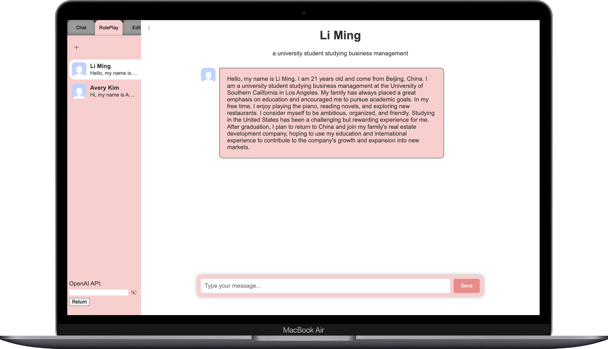

# Chatbot RPG using OpenAI's gpt models

中文 | [English](https://github.com/lilycyf/chatgpt-rpg/blob/master/README.md)

这个项目的目标是利用OpenAI的API创建一个具有独特特征并将其整合到RPG游戏中的聊天机器人。

目前，该项目包括两个构建好的角色，李明和艾弗里·金，你可以在demo的role play与他们互动。为了参与其中，请确保获取自己的OpenAI KPI，并在左下方的输入框中提交。demo是一个没有后端的静态网站，因此你的OpenAI API不会被传输给任何人。除了两个角色之外，你还可以通过chat与基本的ChatGPT进行交流。

注意：你可以按照[OpenAI网站](https://platform.openai.com/account/api-keys)上的说明免费生成OpenAI服务的API密钥。

🔗 [demo](https://lilycyf.github.io/chatgpt-rpg/chatchatchat/demo.html)

## Screenshots

## Getting Started

1. 将此存储库克隆到本地计算机。
2. （可选）创建虚拟环境：
   1. 运行命令 `python3 -m venv venv`以创建名为 "venv" 的新虚拟环境。
   2. 激活虚拟环境，请在终端中运行命令 `source venv/bin/activate`。在 Windows 上，请使用 `.\venv\Scripts\activate`。
3. 在终端中使用 `pip install -r requirements.txt` 命令安装 `requirements.txt` 文件中列出的必需包。
4. 复制 `chatbot` 文件夹下的 `config.py` 文件并将其重命名为 `mine_config.py`。
5. 在终端中运行命令 `python manage.py generate_secret_key` 以在 Django 中生成自己的密钥。然后将 `chatbot` 文件夹下 `mine_config.py` 文件中的 `SECRET_KEY` 替换为你生成的密钥。
6. 在 OpenAI 上注册 API 密钥。请按照 [OpenAI 网站](https://platform.openai.com/account/api-keys) 上的说明生成 OpenAI 服务的 API 密钥，然后将 `chatbot` 文件夹下的 `mine_config.py` 文件中的 `OPENAI_API_KEY` 替换为你自己的密钥。

## Running the Chatbot

注意：如果在步骤2中设置了虚拟环境，则在运行与该项目相关的任何命令之前，你需要激活它。要激活虚拟环境，请运行 `source env/bin/activate`。要停用它，只需运行 `deactivate`命令。

在开始服务器之前，请在终端中导航到项目的根文件夹，并运行命令 `python manage.py migrate`以应用数据库迁移。

要运行聊天机器人，请运行命令 `python manage.py runserver`。然后打开你的Web浏览器，转到 `http://localhost:8000`以访问聊天机器人应用程序。

## Conclusion

该项目提供了如何使用OpenAI的gpt-3.5-turbo构建聊天机器人应用程序的示例。随意修改代码以满足你的需求，并在运行应用程序时不要忘记创建自己的秘密密钥和API密钥。

## License

This project is released under the [MIT License](./LICENSE).
